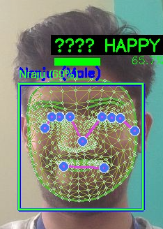

# SignL - Real-Time Sign Language Recognition with Face Recognition

A comprehensive real-time AI system that combines **Sign Language Recognition** using MediaPipe and Transformer models with **Face Recognition** for person identification, **Emotion Detection**, and **Gender Recognition**.

> **Author:** Nagabhushana Raju S  
> **License:** Proprietary  
> **Version:** 1.0.0

## 🚀 Features

- **Real-Time Sign Language Recognition**: Transformer-based model for recognizing sign language gestures
- **Face Recognition**: Identify people from pre-loaded face datasets organized by person folders
- **MediaPipe Integration**: Real-time pose, hand, and face landmark detection with smoothing filters
- **GPU Acceleration**: CUDA support for RTX 4060 and other NVIDIA GPUs
- **WebSocket Streaming**: Real-time video processing with web interface
- **REST API**: Complete API for managing faces and signs
- **Performance Monitoring**: FPS tracking and processing time metrics

## 📁 Project Structure

```
SignL/
├── signl/                      # Main application package
│   ├── __init__.py
│   ├── config.py              # Configuration settings
│   ├── api/                   # FastAPI server
│   │   ├── __init__.py
│   │   ├── main.py           # Main API endpoints
│   │   └── websocket_handler.py  # WebSocket handling
│   ├── models/                # AI models
│   │   ├── __init__.py
│   │   ├── face_processor.py
│   │   ├── sign_classifier.py
│   │   ├── emotion_detector.py
│   │   ├── gender_processor.py
│   │   ├── pytorch_face_recognizer.py
│   │   └── advanced_emotion_processor.py
│   ├── utils/                 # Utilities
│   │   ├── __init__.py
│   │   ├── mediapipe_processor.py
│   │   └── one_euro_filter.py
│   ├── frontend/              # Web interface
│   │   ├── index.html
│   │   └── test.html
│   └── data/                  # Data directory
│       ├── face_data/        # Person folders with face images
│       │   ├── Person_Name_1/
│       │   ├── Person_Name_2/
│       │   └── ...
│       ├── models/           # Pre-trained models
│       ├── training/         # Training data
│       └── cache/            # Cache files
├── tests/                     # Test files
├── docs/                      # Documentation
├── scripts/                   # Utility scripts
├── requirements.txt           # Python dependencies
├── pyproject.toml            # Project configuration
├── start.sh                  # Linux/Mac startup script
├── start.ps1                 # Windows startup script
├── dev.sh                    # Quick development start
└── README.md                 # This file
```

## 🛠️ Setup & Installation

### Quick Start (Codespaces/Linux)

```bash
# Clone or navigate to the repository
cd SignL

# Run the startup script (installs dependencies and starts server)
./start.sh
```

### Manual Setup

#### 1. Create Virtual Environment

```bash
# Create venv
python3 -m venv venv

# Activate (Linux/Mac)
source venv/bin/activate

# Activate (Windows)
venv\Scripts\activate
```

#### 2. Install Dependencies

```bash
# Upgrade pip
pip install --upgrade pip

# Install all dependencies
pip install -r requirements.txt
```

#### 3. Verify Installation

```bash
# Check PyTorch and CUDA
python -c "import torch; print(f'PyTorch: {torch.__version__}'); print(f'CUDA: {torch.cuda.is_available()}')"

# Check MediaPipe
python -c "import mediapipe as mp; print('MediaPipe: OK')"

# Check Face Recognition
python -c "import face_recognition; print('Face Recognition: OK')"
```

### 2. Face Recognition Setup

Your face data should be organized like this:
```
signl/data/face_data/
├── Aishwarya_A/
│   ├── photo1.jpg
│   ├── photo2.jpg
│   └── ... (10+ images recommended)
├── John_Doe/
│   ├── photo1.jpg
│   └── ... (10+ images)
└── Jane_Smith/
    ├── photo1.jpg
    └── ... (10+ images)
```

**Important:**
- Each person gets their own folder named after them
- Add 10+ clear face images per person for best accuracy
- Supported formats: JPG, JPEG, PNG
- Images are automatically processed on first startup
- Encodings are cached for faster subsequent startups

### 3. Sign Language Model Training

```bash
# Train the transformer model (if you have training data)
python src/majorSignL/train_model.py

# The model will be saved as:
# src/data/models/sign_language_transformer.pt
```

## 🔧 Advanced Features

### Face Recognition Models Integration
The system supports additional pre-trained face models:
- **FaceNet**: 177 embeddings loaded from `ds_model_facenet_detector_opencv_aligned_normalization_base_expand_0.pkl`
- **VGGFace**: 51 embeddings loaded from `ds_model_vggface_detector_opencv_aligned_normalization_base_expand_0.pkl`
- **VGG16**: Available but currently empty

These models provide additional verification for face recognition accuracy.

## 🚀 Running the Server

### Option 1: Startup Script (Recommended)

#### Linux/Mac/Codespaces:
```bash
./start.sh
```

#### Windows:
```powershell
.\start.ps1
```

### Option 2: Quick Development Start
```bash
# Assumes dependencies already installed
./dev.sh
```

### Option 3: Manual Start
```bash
# Activate virtual environment
source venv/bin/activate  # Linux/Mac
# OR
venv\Scripts\activate  # Windows

# Start server
python -m uvicorn signl.api.main:app --host 0.0.0.0 --port 8000 --reload
```

### Access the Application

Once started, open your browser and navigate to:
- **Web Interface:** http://localhost:8000/static/index.html
- **API Documentation:** http://localhost:8000/docs
- **Health Check:** http://localhost:8000/health

## 🌐 API Endpoints

### Core Endpoints
- `GET /` - System status and capabilities
- `WebSocket /ws` - Real-time video processing
- `GET /static/index.html` - Web interface

### Face Recognition
- `GET /faces` - List known faces and info
- `POST /faces/refresh` - Refresh face cache
- `GET /debug/face-paths` - Debug face data paths

### Sign Language
- `GET /signs` - Sign classifier information  
- `POST /signs/reset` - Reset current sign sequence
- `POST /signs/confidence/{threshold}` - Set confidence threshold

## 🎯 Usage

1. **Start Server**: Run startup script
2. **Open Browser**: Go to `http://localhost:8000/static/index.html`
3. **Enable Camera**: Allow browser camera access
4. **Real-Time Processing**: 
   - Face recognition runs every 5th frame for performance
   - Sign recognition runs every 2nd frame
   - MediaPipe runs on every frame with filtering

## 🔧 Configuration

### Face Recognition Tuning
- **Threshold**: Adjust face matching threshold (default: 0.5)
- **Cache**: Face encodings are cached for faster startup
- **Performance**: Uses HOG model for speed, CNN for accuracy

### Sign Language Tuning  
- **Confidence**: Set prediction confidence threshold
- **Sequence Length**: 30 frames per sign (configurable)
- **Model**: Transformer architecture with attention

### Performance Optimization
- **GPU**: CUDA acceleration for PyTorch operations
- **Filtering**: One Euro Filter for landmark smoothing
- **Frame Skipping**: Different processing rates per component

## 🐛 Troubleshooting

### Face Recognition Issues
```bash
# Check if faces are loading
curl http://localhost:8000/debug/face-paths

# Refresh face cache
curl -X POST http://localhost:8000/faces/refresh

# Verify face_recognition installation
python -c "import face_recognition; print('OK')"
```

### CUDA Issues
```bash
# Check CUDA availability
python -c "import torch; print(torch.cuda.is_available())"

# Check CUDA version compatibility
nvidia-smi
python -c "import torch; print(torch.version.cuda)"
```

### Performance Issues
- **Reduce frame rates**: Modify frame skipping intervals in main.py
- **Lower resolution**: Adjust frame resize in face_processor.py  
- **Disable features**: Comment out face/sign processing temporarily

## 📊 Performance Metrics

Expected performance on RTX 4060:
- **Overall FPS**: ~7-8 FPS
- **MediaPipe**: ~10-15ms per frame
- **Face Recognition**: ~50-100ms (every 5th frame)
- **Sign Classification**: ~20-40ms (every 2nd frame)

## 🤝 Contributing

1. Fork the repository
2. Create feature branch
3. Test with your GPU/environment
4. Submit pull request

## 📝 License

- Proprarity Lisence 

---

**System Requirements:**
- Python 3.11
- NVIDIA GPU with CUDA support
- 8GB+ RAM
- Webcam for real-time processing

## Owner & Auther 
- Shri: Nagabhushana Raju S 

